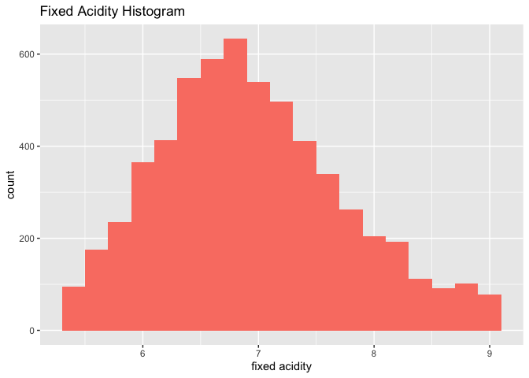

### Part 1 & 2

Data downloaded from Kaggle:
<https://www.kaggle.com/rajyellow46/wine-quality>

### Part 3

There are 13 variables:

<table>
<thead>
<tr class="header">
<th>Name</th>
<th>Attribute</th>
</tr>
</thead>
<tbody>
<tr class="odd">
<td><code>type</code></td>
<td>nominal</td>
</tr>
<tr class="even">
<td><code>fixed acidity</code></td>
<td>numeric (ratio)</td>
</tr>
<tr class="odd">
<td><code>volatile acidity</code></td>
<td>numeric (ratio)</td>
</tr>
<tr class="even">
<td><code>citric acid</code></td>
<td>numeric (ratio)</td>
</tr>
<tr class="odd">
<td><code>residual sugar</code></td>
<td>numeric (ratio)</td>
</tr>
<tr class="even">
<td><code>chlorides</code></td>
<td>numeric (ratio)</td>
</tr>
<tr class="odd">
<td><code>free sulfur dioxide</code></td>
<td>numeric (ratio)</td>
</tr>
<tr class="even">
<td><code>total sulfur dioxide</code></td>
<td>numeric (ratio)</td>
</tr>
<tr class="odd">
<td><code>density</code></td>
<td>numeric (ratio)</td>
</tr>
<tr class="even">
<td><code>pH</code></td>
<td>numeric (interval)</td>
</tr>
<tr class="odd">
<td><code>sulphates</code></td>
<td>numeric (ratio)</td>
</tr>
<tr class="even">
<td><code>alcohol</code></td>
<td>numeric (ratio)</td>
</tr>
<tr class="odd">
<td><code>quality</code></td>
<td>numeric (ratio), discrete could also be considered categorical</td>
</tr>
</tbody>
</table>

### Part 4

##### Looking at quality points, `quality`:

<table class=" lightable-minimal" style="font-family: &quot;Trebuchet MS&quot;, verdana, sans-serif; width: auto !important; margin-left: auto; margin-right: auto;">
<caption>
Summary Stats for Quality Points
</caption>
<thead>
<tr>
<th style="text-align:right;">
mean
</th>
<th style="text-align:right;">
median
</th>
<th style="text-align:right;">
mode
</th>
<th style="text-align:right;">
IQR
</th>
</tr>
</thead>
<tbody>
<tr>
<td style="text-align:right;">
5.818378
</td>
<td style="text-align:right;">
6
</td>
<td style="text-align:right;">
6
</td>
<td style="text-align:right;">
1
</td>
</tr>
</tbody>
</table>

Appears normal; maybe a slight right skew. Will likely treat this as
nominal.

##### Looking at fixed acidity, `fixed acidity`:

<table class=" lightable-minimal" style="font-family: &quot;Trebuchet MS&quot;, verdana, sans-serif; width: auto !important; margin-left: auto; margin-right: auto;">
<caption>
Summary Stats for Fixed Acidity
</caption>
<thead>
<tr>
<th style="text-align:right;">
mean
</th>
<th style="text-align:right;">
median
</th>
<th style="text-align:right;">
mode
</th>
<th style="text-align:right;">
IQR
</th>
</tr>
</thead>
<tbody>
<tr>
<td style="text-align:right;">
7.216579
</td>
<td style="text-align:right;">
7
</td>
<td style="text-align:right;">
6.8
</td>
<td style="text-align:right;">
1.3
</td>
</tr>
</tbody>
</table>

Moderate-high right skew.

##### Looking at alcohol content, `alcohol`:

<table class=" lightable-minimal" style="font-family: &quot;Trebuchet MS&quot;, verdana, sans-serif; width: auto !important; margin-left: auto; margin-right: auto;">
<caption>
Summary Stats for Alcohol Content
</caption>
<thead>
<tr>
<th style="text-align:right;">
mean
</th>
<th style="text-align:right;">
median
</th>
<th style="text-align:right;">
mode
</th>
<th style="text-align:right;">
IQR
</th>
</tr>
</thead>
<tbody>
<tr>
<td style="text-align:right;">
10.4918
</td>
<td style="text-align:right;">
10.3
</td>
<td style="text-align:right;">
9.5
</td>
<td style="text-align:right;">
1.8
</td>
</tr>
</tbody>
</table>

Highly right-skewed.

### Part 5

There appears to be outliers certainly looking at the histograms of the
fixed acidity and alcohol content. I computed the IQR for those two
variables and quality points in the summary statistics tables above.

##### For `quality` the mean = ~5.82 and the IQR = 1.

    # minor outlier = + or - IQR*1.5; 1(1.5) = 1.5
    5.82-1.5

    ## [1] 4.32

    5.82+1.5

    ## [1] 7.32

This means that values less than 4.32 and greater than 7.32 are
considered outliers. Quality points are only in whole numbers, so I
would consider values less than 4 and greater than 8 minor outliers. The
minimum value is 3 and the maximum is 9 for quality points; these values
are few and barely minor outliers so I wouldn’t remove these
observations.

##### For `fixed acidity` the mean = ~7.22 and the IQR = 1.3.

    7.22 - 1.5*1.3

    ## [1] 5.27

    7.22 + 1.5*1.3

    ## [1] 9.17

Values less than 5.27 and greater than 9.17 considered minor outliers.
Lots of observations would be removed (~1000). Maybe I would increase my
multiplier to 3 and remove major outliers if any? What would the data
look like with the minor outliers removed?

Looks better with these removed, however may consider checking out
transformations before removing outliers. This is quite a large data set
so I’m not too worried about removing so many observations…

##### For `alcohol` the mean = ~10.49 and the IQR = 1.8.

    10.49 - 1.5*1.8

    ## [1] 7.79

    10.49 + 1.5*1.8

    ## [1] 13.19

Minor outliers would be less than 7.79 and greater than 13.19. This is
only about 100 observations and they are pretty close to the edge so I
would keep them.

### Part 6

##### Comparing alcohol content (`alcohol`) and `fixed acidity`:

A low-moderate negative correlation. Outliers are definitely an issue.
I’ve colored the points for fun because I think in the future it would
be cool to see the differences between red and white wines.

##### Comparing alcohol content (`alcohol content`) and ph level (`pH`):

Not seeing much correlation here.

### Part 7

